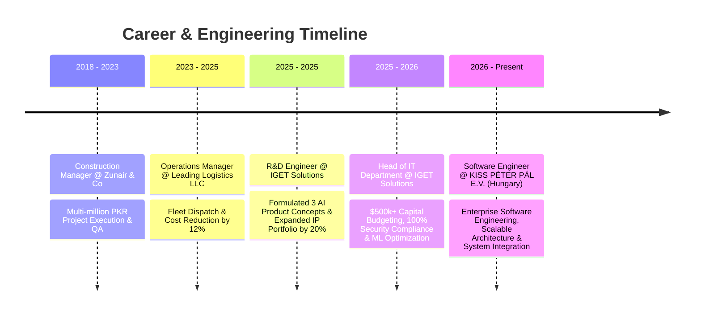

# ⚡ MUHAMMAD ABU ZAR QURESHI ⚡
### 💻 Software Engineer • 🛡️ Head of IT • R&D Engineer • CEH & ISO/IEC 27001:2022 Lead Implementer & Auditor • Avionics Engineer

  

[-7B2CBF?style=for-the-badge&logo=codeforces&logoColor=white)](#)

---

## 🛰️ Executive Profile & Bio

> **Strategic & Accomplished Software Engineer and Technology Leader** with extensive expertise directing **Software Engineering**, **R&D Initiatives**, **Cybersecurity Governance**, and **Enterprise IT Infrastructure**. Proven track record in orchestrating digital transformations, managing **$500k+ IT capital budgets**, and engineering scalable AI-driven automation systems that reduce operational overhead and elevate security compliance to **100%**.

* 💻 **Current Role**: **Software Engineer** @ *KISS PÉTER PÁL E.V.* (Budapest / Szolnok, Hungary | July 2026 – Present)
* 🏢 **Prior Leadership**: **Head of IT Department** & **R&D Engineer** @ *IGET Solutions Pvt Ltd*
* 🎓 **Education**: **B.S. in Avionics Engineering** (The Superior University) | **Chartered Accountant (Accounts)** (Rise / ICAP)
* 🛡️ **Cybersecurity Certifications**: **Certified Ethical Hacker (CEH)** | **ISO/IEC 27001:2022 Lead Implementer & Auditor**
* 🔬 **Focus Areas**: Software Architecture, AI/ML Automation, Threat Intelligence & Penetration Testing, Cloud Infrastructure.

---

## 📜 Certifications & Compliance Credentials

<table align="center" width="100%">
  <tr>
    <td width="50%" align="center">
      
       <b>Certified Ethical Hacker (CEH)</b>
       <i>Offensive Security, Vulnerability Assessment & Penetration Testing</i>
    </td>
    <td width="50%" align="center">
      
       <b>ISO/IEC 27001:2022 Lead Implementer & Auditor</b>
       <i>Information Security Management Systems (ISMS) & Compliance Governance</i>
    </td>
  </tr>
  <tr>
    <td width="50%" align="center">
      
       <b>Ethical Hacking Essentials</b>
       <i>Network Defense, Digital Forensics & Threat Vector Analysis</i>
    </td>
    <td width="50%" align="center">
      
       <b>Python Programming Specialist</b>
       <i>AI/ML Scripting, Data Pipeline Automation & Backend Engineering</i>
    </td>
  </tr>
</table>

---

## 💼 Leadership & Engineering Career Matrix

---

## 🛠️ Advanced Tech Stack & Ecosystem

### 🛡️ Cybersecurity, Governance & Infrastructure

### 🧠 Artificial Intelligence, Machine Learning & R&D

### ☁️ Cloud, DevOps & Server Infrastructure

### 💻 Enterprise Backend & Database Systems

---

## 🚀 Key Enterprise & R&D Deployments

<table width="100%">
  <tr>
    <td width="50%" valign="top">
      <h3>🇭🇺 KISS PÉTER PÁL E.V. (Hungary)</h3>
      
Engineering robust enterprise software solutions, API services, and system architectures (Appointed July 2026).

      <a href="mailto:aipeterpal@gmail.com"><b>📧 Enterprise Engineering Inquiry</b></a>
    </td>
    <td width="50%" valign="top">
      <h3>🏢 Enterprise CRM Infrastructure</h3>
      
Deployed scalable CRM ecosystem for US Arizona client (AP Appliance AZ), elevating sales pipeline tracking & conversion rates by 24%.

      <a href="https://crm-apapplianceaz.com/"><b>🌐 Live CRM Portal</b></a>
    </td>
  </tr>
  <tr>
    <td width="50%" valign="top">
      <h3>📞 Auto Dialer Pro Platform</h3>
      
Engineered high-throughput communication & autodialer platform for US-based Pakistani enterprise with automated call routing.

      <a href="https://crm.autodialpro.com/"><b>🌐 Live AutoDialer Platform</b></a>
    </td>
    <td width="50%" valign="top">
      <h3>📦 PackFocus-Bot (AI Chatbot)</h3>
      
Domain-restricted custom packaging AI assistant featuring multi-model fallback orchestration & real-time neural TTS audio synthesis.

      <a href="https://github.com/aimuhammadabuzarqureshi-cloud/PackFocus-Bot"><b>📦 GitHub Repository</b></a>
    </td>
  </tr>
</table>

---

## 📊 Live GitHub Statistics & Trophies

### 🏆 GitHub Achievements & Trophies

 

<table border="0">
  <tr>
    <td>
      
    </td>
    <td>
      
    </td>
  </tr>
</table>

 

 

### ✍️ Tech Thought of the Day

---

### 💬 Connect with Me

*© 2026 Muhammad Abu Zar Qureshi — Software Engineer @ KISS PÉTER PÁL E.V. (Hungary)*

